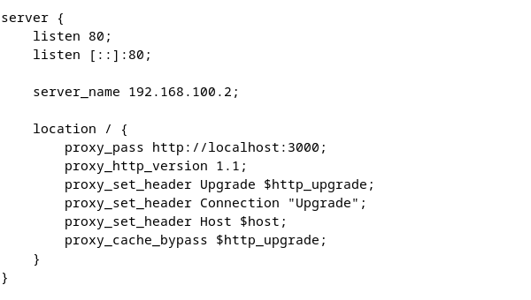
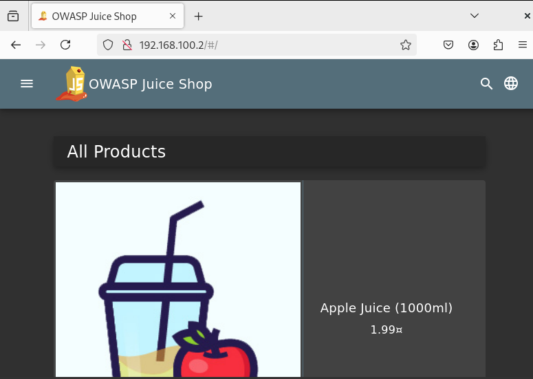

# WAF-Protection-for-OWASP-Juice-Shop-using-Open-AppSec
## 📖 Project Overview

This project aims to demonstrate how a Web Application Firewall (WAF) can protect vulnerable web applications from real-world attacks. Using an intentionally vulnerable application, OWASP Juice Shop, I simulate common web threats and analyze how Open AppSec — a modern open-source WAF — mitigates them.

The environment is based on Debiam 12 and uses Nginx as a reverse proxy in front of the Juice Shop. Open AppSec is integrated into the proxy server to inspect and filter malicious HTTP traffic. Attack scenarios are executed before and after WAF deployment to compare system behavior and security visibility.

## 🎯 Project Goals

- Understand the role of a Web Application Firewall (WAF) in modern web security.
- Deploy and configure Open AppSec in front of a vulnerable web application.
- Simulate and analyze common web attacks such as SQL injection and XSS.
- Evaluate the detection and prevention capabilities of Open AppSec.
- Explore how WAF logs can be used for security monitoring and incident response.

## 🧪 Tools and Technologies

| Component         | Role                        |
| ----------------- | --------------------------- |
| Debian 12         | Used as a ......            |
| OWASP Juice Shop  | Web application             |
| Open AppSec       | Open Source WAF             |
| NGINX             | reverse proxy for juiceshop |
| Wazuh             | Log aggregation & alerting  |

## 1. Lab  Setup
#### Install OWASP Juice shop on Debian 12:
- [Downloaded docker image and run it](https://pwning.owasp-juice.shop/companion-guide/latest/part1/running.html#_docker_image)
- install NGINX and configure /etc/nginx/sites-available/default:

##### here is the app:

